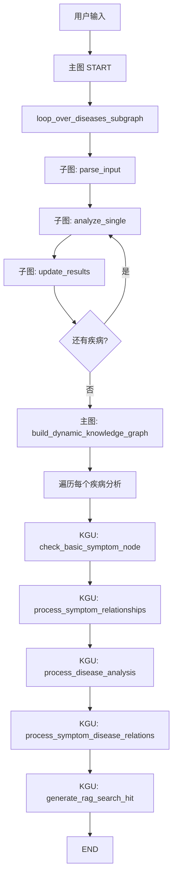

# 医疗疾病分析与知识图谱更新系统功能点文档

## 1. 概述
本系统是一个基于 **LangGraph** 构建的医疗领域疾病分析工具，能够**解析用户症状数据**，结合已有疾病补充列表（含概率），筛选出高概率疾病，并对每个疾病依次调用 **7 个 LLM 分析节点**（原始概念、病程、人体系统、表现特征、症状性质、严重程度、人类描述），最终将分析结果**写入 Neo4j 知识图谱**和 **RAG 向量库**，实现知识的持久化与检索增强。

## 2. 核心功能模块

| 模块 | 功能描述 |
|------|----------|
| **高概率疾病筛选** | 根据用户输入的疾病补充列表（含概率百分比），筛选概率超过阈值的疾病，仅对高概率疾病进行深度分析 |
| **原子分析节点序列** | 对每个疾病独立执行 7 个 LLM 分析任务： • 原始概念症状分析 • 病程分析（急性/慢性等） • 人体系统累及分析（呼吸系统、免疫系统等） • 表现特征分析（阵发性、持续性等） • 症状性质分析（保护性反射、病理性等） • 严重程度分析（轻/中/重/危重） • 人类描述生成（将用户会话转换为自然语言描述） |
| **循环子图处理** | 使用 LangGraph 子图循环迭代处理每个高概率疾病，自动管理当前索引和结果累积 |
| **动态知识图谱写入** | 将每个疾病的分析结果写入 Neo4j 图数据库： • 创建/更新 `basic_symptom` 节点（原子症状，累加命中次数） • 创建/更新 `disease_analysis` 节点（存储疾病全部分析字段） • 建立症状间无向关系 `symptom`（权重累加） • 建立症状→疾病有向关系 `include_disease`（权重累加） |
| **RAG 语义数据上传** | 将疾病分析关键信息（原子症状、相关症状、阴性症状、严重程度、人类描述）上传至向量数据库，供后续检索增强生成使用 |

## 3. 工作流节点详解
系统采用**两层图结构**：主图包含一个子图节点和知识图谱更新节点；子图内部循环执行单疾病分析节点序列。

### 3.1 主图节点

| 节点名称 | 输入 | 输出 | 作用 |
|----------|------|------|------|
| `loop_over_diseases_subgraph` | 用户原始消息（含症状数据、疾病补充列表） | 高概率疾病的完整分析列表 | 调用独立子图完成所有高概率疾病的逐个分析 |
| `build_dynamic_knowledge_graph` | 高概率疾病分析结果列表 + 伴随/阴性症状 + 严重程度 | 无返回值（仅更新知识图谱和 RAG） | 遍历每个疾病分析结果，调用知识图谱更新服务写入 Neo4j 和向量库 |

### 3.2 子图内部节点（单疾病循环）

| 节点名称 | 输入 | 输出 | 作用 |
|----------|------|------|------|
| `parse_input` | 原始用户消息（JSON 字符串） | 解析后的疾病列表、症状描述文本、用户会话消息 | 筛选高概率疾病，构建标准症状描述，提取用户会话 |
| `analyze_single` | 当前疾病信息 + 症状描述 + 用户消息 | 7 个 LLM 分析结果合并为 `current_analysis` 字典 | 依次调用：原始概念、病程、人体系统、表现特征、症状性质、严重程度、人类描述生成 |
| `update_results` | 当前分析结果 | 更新后的分析列表，当前索引+1 | 将当前疾病分析追加到结果列表，递增索引 |
| `should_continue`（条件边） | 当前索引与疾病列表长度 | `"continue"` 或 `"end"` | 若还有未处理疾病，跳转回 `analyze_single`；否则结束子图 |

### 3.3 知识图谱更新节点（内部服务）

| 节点名称 | 输入 | 输出 | 作用 |
|----------|------|------|------|
| `check_basic_symptom_node` | 原始概念症状列表 | 无 | 检查每个原子症状是否存在于 Neo4j，不存在则创建（初始命中次数1），存在则命中次数+1 |
| `process_symptom_relationships` | 原子症状列表 | 无 | 对列表中每对症状创建无向关系，权重累加固定步长 |
| `process_disease_analysis` | 疾病分析全量字段 | 无 | 创建或更新疾病分析节点，存储所有分析维度 |
| `process_symptom_disease_relations` | 原子症状列表 + 疾病名称 | 无 | 为每个原子症状创建指向当前疾病的有向关系，权重累加固定步长 |
| `generate_rag_search_hit` | 原子症状、相关症状、阴性症状、严重程度、人类描述 | 无 | 将上述信息拼接为文本，上传至向量库（两个集合：命中数据、意图数据） |

## 4. 路由与流程

## 5. 持久化机制

本系统将分析结果持久化到两类存储：

| 存储类型 | 具体实现 | 持久化内容 |
|----------|----------|------------|
| **Neo4j 图数据库** | Cypher 操作封装 | • `basic_symptom` 节点（原子症状名称 + 命中次数） • `disease_analysis` 节点（疾病的 8 个分析维度字段） • 症状间关系 `symptom`（无向，权重） • 症状→疾病关系 `include_disease`（有向，权重） |
| **向量数据库（RAG）** | 本地向量库服务 | • 命中数据：疾病名称 + 原子症状、相关症状、阴性症状、严重程度 • 意图数据：疾病名称 + 人类描述文本 |

## 6. 主要数据流（状态字段）

### 子图状态

| 字段 | 类型 | 说明 |
|------|------|------|
| `messages` | `List[BaseMessage]` | 外部传入的原始消息（含用户输入 JSON） |
| `diseases_list` | `List[Dict]` | 筛选后的高概率疾病列表，每项含名称、症状、原因、概率 |
| `disease_desc` | `str` | 预生成的症状描述文本（主诉+现病史+伴随/阴性症状） |
| `human_message` | `List[str]` | 用户原始会话消息列表 |
| `current_index` | `int` | 当前正在处理的疾病索引 |
| `current_analysis` | `Dict` | 当前疾病的 7 个分析结果汇总 |
| `high_prob_diseases_analysis` | `List[Dict]` | 最终输出的所有疾病分析列表 |
| `has_symptoms` | `Dict` | 伴随症状和阴性症状 |
| `last_severity` / `disease_severity` | `Dict` | 严重程度分析结果（临时/最终） |

### 知识图谱更新状态

| 字段 | 类型 | 说明 |
|------|------|------|
| `disease_analysis` | `Dict` | 单个疾病的完整分析结果（包含 7 个维度的子字典） |
| `has_symptoms` | `Dict` | 伴随症状和阴性症状列表 |
| `disease_severity` | `Dict` | 严重程度等级和推理依据 |

## 7. 典型使用流程

1. **准备输入数据**：构造符合格式的 JSON，包含主诉、现病史、伴随症状、阴性症状、已有疾病补充列表（JSON 字符串数组）、用户会话消息数组。

2. **初始化服务**：创建主服务实例（可覆盖概率阈值等参数）。

3. **调用分析接口**：传入 JSON 字符串或字典。

4. **内部处理**：
   - 子图解析输入 → 筛选高概率疾病 → 循环对每个疾病调用 7 个 LLM 分析节点 → 返回分析列表。
   - 主图遍历分析列表，对每个疾病调用知识图谱更新服务：
     - 更新/创建原子症状节点及命中次数
     - 建立症状间关系
     - 存储疾病分析节点（全量字段）
     - 建立症状→疾病关系
     - 上传 RAG 语义数据

5. **获取结果**：返回包含高概率疾病分析列表的字典，每个元素为疾病的详细分析。