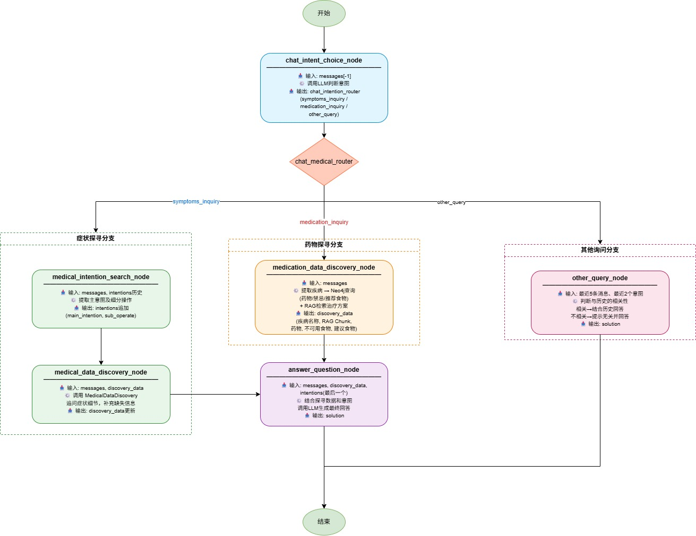

# 医疗对话助手系统功能点文档

## 1. 概述
本系统是一个基于 **LangGraph** 构建的医疗领域智能对话助手，能够理解用户意图（**症状咨询/药物咨询**），通过**知识图谱**和**检索增强生成（RAG）** 提供专业的医疗建议。系统支持两种**会话持久化**方案，并提供了友好的**命令行交互界面**。

## 2. 核心功能模块

| 模块 | 功能描述 |
|------|----------|
| **意图识别** | 分析用户消息，提取主意图（`main_intention`）和细分操作（`sub_operate`），支持多轮意图历史追踪 |
| **症状探寻** | 主动收集患者症状、病史、用药情况等医疗信息，为后续诊断提供依据 |
| **药物探寻** | 识别用户提及的疾病名称，查询知识图谱获取对应药物、饮食禁忌和推荐食物，并结合RAG检索治疗方案 |
| **医疗问答生成** | 综合意图信息和已收集的数据，生成自然、专业的回答 |
| **通用闲聊** | 处理非医疗咨询内容（如日常聊天），并提示用户对话主题切换 |
| **会话持久化** | 支持短期（`SessionStore`）和长期（`LangGraph Checkpointer`）两种状态保存方案，可恢复历史对话 |

## 3. 工作流节点详解
系统采用**有向图（StateGraph）** 组织任务，各节点功能如下：

### 3.1 `chat_intent_choice_node` – 意图路由决策
- **输入**：用户最新消息  
- **输出**：`chat_intention_router` 字段，取值为 `symptoms_inquiry`（症状探寻）、`medication_inquiry`（药物探寻）或 `other_query`（其他）  
- **作用**：作为工作流的入口判断节点，决定后续分支。

### 3.2 `medical_intention_search_node` – 意图提取
- **输入**：会话消息历史 + 历史意图列表  
- **输出**：当前轮次的意图字典（`main_intention` + `sub_operate`）  
- **实现**：调用LLM解析用户消息，返回结构化JSON。

### 3.3 `medical_data_discovery_node` – 症状信息收集
- **输入**：历史消息 + 已收集的探寻数据（`discovery_data`）  
- **输出**：更新后的 `discovery_data`（如症状、持续时间、过敏史等）  
- **实现**：委托给 `MedicalDataDiscovery` 服务，综合RAG和规则逻辑。

### 3.4 `medication_data_discovery_node` – 药物信息收集
- **输入**：用户最新消息  
- **输出**：包含以下字段的 `discovery_data`：  
  - **疾病名称**：从消息中识别的疾病  
  - **RAG Chunk**：检索到的治疗方案片段  
  - **药物**：知识图谱中该疾病对应的药物列表  
  - **不可使用食物**：禁忌食物  
  - **建议食用食物**：推荐食物  
- **实现**：使用LLM提取疾病名 → 查询Neo4j知识图谱 → RAG检索补充。

### 3.5 `answer_question_node` – 答案生成
- **输入**：会话消息、最新意图、`discovery_data`  
- **输出**：最终回答文本（存入 `solution` 字段）  
- **实现**：将上述信息组织为提示词模板，调用LLM生成回答。

### 3.6 `other_query_node` – 通用回应
- **输入**：历史消息 + 意图信息  
- **输出**：普通聊天回复，并提示用户当前话题与历史无关（若适用）

## 4. 路由与流程

## 5. 持久化机制

### 5.1 短期方案 – `SessionStore`
- **存储内容**：会话标题、消息历史、每轮意图字典、`discovery_data`、路由选择结果  
- **API**：  
  - `create_session()` → 生成新会话ID  
  - `add_message(session_id, role, content)` – 增量保存消息  
  - `add_intention_round(...)` – 保存每轮意图及关联数据  
  - `restore_state(session_id)` – 恢复完整状态字典  
  - `list_sessions()` – 列出所有会话（供交互式选择）  
- **适用场景**：快速原型、无外部数据库依赖、支持会话列表管理。

### 5.2 长期方案 – `LangGraph Checkpointer`
- **实现**：兼容任何 LangGraph 检查点接口（如 `SqliteSaver`、`RedisSaver`）  
- **存储粒度**：整个图状态的快照（`MedicalChatState`）  
- **恢复方式**：通过 `thread_id`（即 `session_id`）自动加载最新检查点  
- **适用场景**：生产环境、需要完整状态回滚、跨会话持久化。

### 5.3 无持久化模式
仅用于调试或一次性对话，不保存任何状态。

## 6. 交互式命令行界面
- **启动方式**：调用 `assistant.run_interactive()`  
- **功能**：  
  - 启动时询问用户选择“新建会话”或“加载历史会话”  
  - 支持 `SessionStore` 下列出历史会话（标题、更新时间）  
  - 循环接收用户输入，调用 `process_message()` 并打印助手回复  
  - 输入 `exit` 或 `quit` 退出  
- **适用性**：短期方案或长期方案均可使用（长期方案下列表功能不可用，但会提示创建新会话）

## 7. 外部依赖与集成

| 组件 | 用途 | 集成方式 |
|------|------|----------|
| `MedicalDataDiscovery` | 症状信息收集、RAG检索 | 类注入（内部实例化） |
| `Neo4jQueryTools` | 知识图谱查询（药物、食物） | 类注入 |
| `LangChain` | LLM调用、消息结构 | `get_base_chat_model()` 返回 ChatModel |
| `LangGraph` | 状态图工作流 | `StateGraph`, `add_messages` 等 |
| 提示词模板 | 各节点使用的Prompt | 外部 `.txt` 文件（路径见 `PROMPT_PATHS`） |

## 8. 主要数据流（状态字段）

`MedicalChatState` 包含以下关键字段：

| 字段 | 类型 | 说明 |
|------|------|------|
| `messages` | `List[BaseMessage]` | 对话消息历史（自动追加，使用 `add_messages` 归约器） |
| `intentions` | `List[Dict]` | 每轮意图字典列表，通过 `operator.add` 追加 |
| `discovery_data` | `Dict` | 已收集的医疗信息（症状、药物等） |
| `solution` | `str` | 最终回答文本 |
| `chat_intention_router` | `str` | 当前轮次路由结果（`symptoms_inquiry` / `medication_inquiry` / `other_query`） |
| `session_id` | `str` | 会话唯一标识 |

## 9. 典型使用流程

1. **初始化**：选择持久化方式，创建 `MedicalChat` 实例。  
2. **新建会话**：系统生成 `session_id`，清空状态。  
3. **用户输入**：调用 `process_message(user_input)`。  
4. **内部处理**：  
   - 路由节点判断意图类型。  
   - 若为 **症状探寻** → 提取意图 → 收集数据 → 生成回答。  
   - 若为 **药物探寻** → 识别疾病 → 查询图谱和RAG → 生成回答。  
   - 若为 **其他** → 直接生成闲聊回复。  
5. **状态持久化**（根据所选方案）：  
   - `SessionStore`：增量保存消息和意图轮次。  
   - `Checkpointer`：自动保存完整图状态。  
6. **返回回答** 并显示给用户。

## 10. 注意事项

- 当前实现中，`MedicalDataDiscovery` 和 `Neo4jQueryTools` 为**外部依赖**，需确保其正确初始化。【已完成】
- **提示词文件需按指定路径放置**，否则会抛出文件读取异常。【已完成】
- 两种持久化方案**不可同时使用**（构造函数会检查并抛出 `ValueError`）。【已完成】
- 长期方案下，`SessionStore.list_sessions()` 不可用，交互式界面的历史会话加载功能会受限，但可通过其他方式管理 `thread_id`。【已完成】

