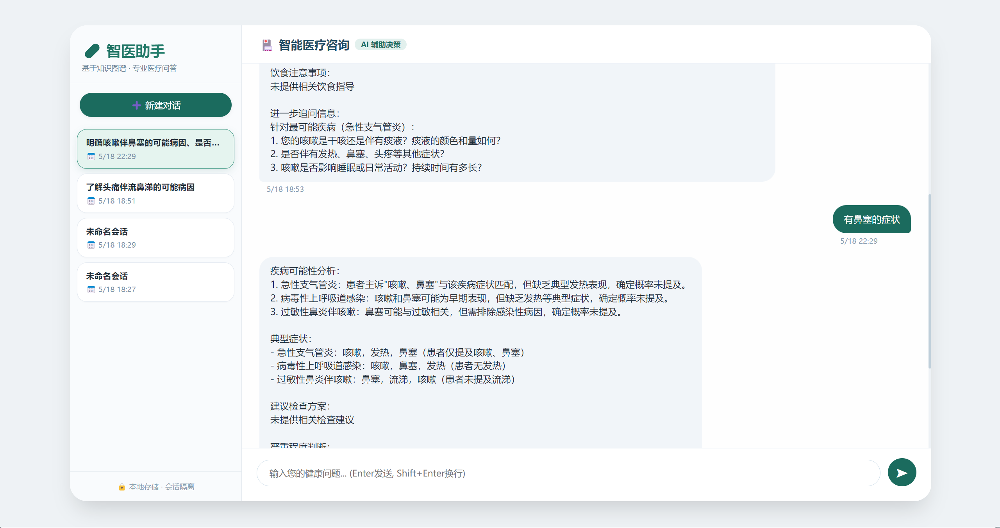
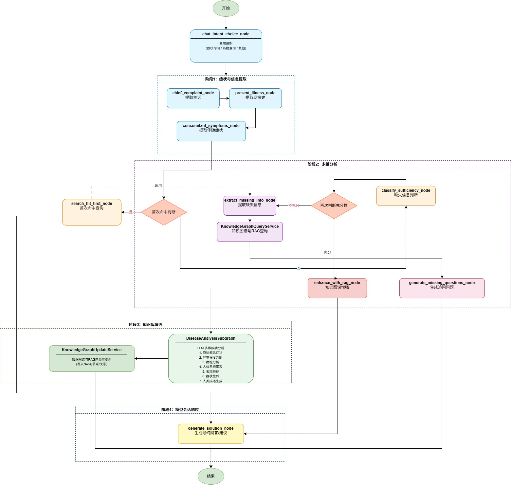

# 医疗辅助诊断会话助手

基于 LangGraph 构建的医疗领域智能对话系统，支持症状咨询与药物咨询意图识别，通过知识图谱与 RAG 提供专业医疗建议。系统包含四大核心子系统：**医疗对话助手**、**医疗信息探寻查询图**、**疾病知识图谱+RAG 查询分析**、**知识图谱更新与持久化**。

---

---

# 技术点

- **命中知识逻辑**：设计的**双知识图谱+RAG**逻辑。分为**基础知识图谱**和**命中知识图谱**。**基础知识图谱**用于存储规则、定义、基础的知识信息。
**命中知识图谱**用于**存储最新的数据**、**外部获取的数据**、**关系数据**、**意图数据**，用于会话中快速对问题进行回复和**保证知识融合更新**
基于医学基准症状原子化，构建症状-类型知识图谱；节点命中权重机制（多次命中提高权重，相同症状优先查询）。  
- **会话意图链分析**：长意图分析和步骤意图分析，通过“回答完整度”进行知识探寻，利用意图框架约束回答。  
- **动态知识图谱**：通过模型动态检测、审核、构建、合并新增节点；可根据病例信息直接构建结点。  
- **JSON 异常处理**：微调模型处理 JSON 生成异常，提升鲁棒性。  
- **RAG + 知识图谱**：知识图谱存储学术名称及关系；RAG 通过重构成字符串生成结构化知识。  
- **RAG 排序**：BGE（粗排）+ M3（细排）。  
- **多维度疾病分析**：7 个独立的 LLM 分析维度，覆盖症状、病程、人体系统、表现、性质、严重程度、人类描述。  
- **存储设计**：LangGraph 的 `SqliteSaver`（基于 SQLite）持久化状态。 

---

## 路由流程

)

# 子系统一：医疗对话助手

基于 **LangGraph** 的智能对话助手，理解用户意图（症状咨询/药物咨询），支持两种会话持久化方案及命令行交互。

## 核心功能模块

| 模块 | 功能描述 |
|------|----------|
| **意图识别** | 提取 `main_intention` 和 `sub_operate`，支持多轮意图追踪 |
| **症状探寻** | 委托 `MedicalDataDiscovery` 主动收集症状、病史、用药情况 |
| **药物探寻** | 识别疾病名 → 查询 Neo4j 图谱（药物、饮食禁忌、推荐食物）→ RAG 补充治疗方案 |
| **医疗问答生成** | 综合意图与 `discovery_data`，调用 LLM 生成专业回答 |
| **通用闲聊** | 处理非医疗咨询，提示主题切换 |
| **会话持久化** | 短期（`SessionStore`）与长期（`LangGraph Checkpointer`）两种方案 |

## 工作流节点

| 节点 | 作用 |
|------|------|
| `chat_intent_choice_node` | 路由决策：`symptoms_inquiry` / `medication_inquiry` / `other_query` |
| `medical_intention_search_node` | LLM 解析当前轮次意图 |
| `medical_data_discovery_node` | 症状信息收集（委托 `MedicalDataDiscovery`） |
| `medication_data_discovery_node` | 药物信息收集（疾病名 → 图谱 → RAG） |
| `answer_question_node` | 生成最终回答 |
| `other_query_node` | 通用闲聊回应 |

## 状态字段（`MedicalChatState`）

| 字段 | 说明 |
|------|------|
| `messages` | 对话历史（`add_messages` 归约） |
| `intentions` | 每轮意图字典列表 |
| `discovery_data` | 已收集的症状/药物等信息 |
| `solution` | 最终回答文本 |
| `chat_intention_router` | 当前路由结果 |
| `session_id` | 会话唯一标识 |

## 持久化方案

- **短期（`SessionStore`）**：存储会话标题、消息、意图、`discovery_data`，提供 `create_session`、`restore_state`、`list_sessions` 等 API，适合快速原型。  
- **长期（`LangGraph Checkpointer`）**：通过 `SqliteSaver` 等保存完整图状态快照，通过 `thread_id` 恢复，适合生产环境。  
- **无持久化**：仅调试用。

## 命令行交互

`assistant.run_interactive()` 启动，支持新建/加载历史会话（短期方案下列表历史，长期方案提示创建新会话）。

---

# 子系统二：医疗信息探寻查询图

基于 **LangGraph** 的主动信息探寻助手，逐步收集症状、现病史、伴随症状，通过信息充分性判断决定追问或生成初步诊断建议。

## 核心功能模块

| 模块 | 功能描述 |
|------|----------|
| **主诉提取** | 提取核心痛苦/问题（如“头痛”） |
| **现病史结构化** | 提取发病时间、发作规律、已接受治疗 |
| **伴随症状识别** | 区分存在的症状（`associated_symptoms`）和明确不存在的症状（`symptom_absent`） |
| **信息充分性判断** | 置信度 ≥0.7 视为充足，输出 `missing_info` |
| **RAG 知识增强** | 查询医学知识库，补充疾病知识片段 |
| **知识图谱查询（信息不足时）** | RAG 检索 → 提取疾病名 → 查询 Neo4j 结构化信息 |
| **缺失信息追问** | 根据 `missing_info` 生成提问 |
| **解决方案生成** | 输出“可能诊断 + 下一步行动 + 免责声明” |
| **首次命中快速查询** | 优先调用 `DiseaseDataSearchService`，跳过完整判断流程 |
| **数据持久化** | 调用 `DiseaseDataHitGenService` 存储会话用于模型训练 |

## 工作流节点

| 节点 | 作用 |
|------|------|
| `chief_complaint_node` | LLM 提取主诉列表 |
| `present_illness_node` | 结构化现病史（`with_structured_output`） |
| `concomitant_symptoms_node` | 识别伴随/阴性症状 |
| `classify_sufficiency_node` | 充分性判断（阈值 0.7） |
| `enhance_with_rag_node` | RAG 知识增强 |
| `generate_solution_node` | 生成初步诊断建议 |
| `extract_missing_info_node` | RAG + 图谱查询缺失信息 |
| `recheck_sufficiency_node` | 重新判断充分性 |
| `generate_missing_questions_node` | 生成追问问题 |
| `search_hit_first_node` | 首次命中快速查询 |
| `build_search_db_node` | 数据持久化 |

## 状态字段（`MedicalInquiryState`）

| 字段 | 说明                                 |
|------|------------------------------------|
| `chief_complaint` | 主诉列表                               |
| `present_illness` | 发病时间、规律、治疗                         |
| `associated_symptoms` / `symptom_absent` | 伴随/阴性症状                            |
| `existing_knowledge_supplement` | RAG/图谱补充的知识                        |
| `is_sufficient` | 信息是否充足                             |
| `missing_info` | 用户提问中需要补充的症状信息（`MedicalAdvice` 结构） |
| `is_first_search_hit` | 首次命中标志（默认 `True`）                  |
| `solution` | 最终回答或追问文本                          |

---

# 子系统三：疾病知识图谱 + RAG 查询分析系统

基于 **LangGraph** 的智能分析工具，解析症状与病史，筛选高概率疾病，执行多维度 LLM 分析，整合知识图谱与 RAG 生成结构化诊断报告。

## 核心功能模块

| 模块 | 功能描述 |
|------|----------|
| **输入解析与高概率疾病筛选** | 从 `existing_knowledge_supplement` 提取疾病候选，按概率阈值（默认 70%）筛选 |
| **疾病分析子图** | 对每个疾病执行 7 个维度的 LLM 分析：原始概念症状、病程、人体系统、表现特征、症状性质、严重程度、人类描述生成 |
| **知识图谱查询** | 查询症状节点、疾病节点属性、症状间关系（`symptom`）、症状→疾病关系（`include_disease`），记录权重 |
| **RAG 历史命中检索** | 基于疾病名+症状+严重程度检索向量库中的历史案例片段 |
| **报告生成** | 为每个疾病附加 RAG 参考片段（前 2 条）和图谱置信度（平均权重），输出格式化报告 |

## 工作流节点（分层图）

**子图：`DiseaseAnalysisSubgraph`**
- `parse_input`：解析输入，构建症状描述，筛选高概率疾病  
- `analyze_single`：7 个维度 LLM 分析（各提示词模板独立）  
- `update_results`：追加分析结果，更新严重程度  
- 条件循环：若还有疾病则返回 `analyze_single`

**主图节点**
- `search_rag_and_knowledge_graph`：对每个疾病调用知识图谱查询 + RAG 检索  
- `process_kg_results`：关联查询结果，提取 RAG 参考片段，计算 `graph_confidence`，生成格式化报告

## 状态字段（主图）

| 字段 | 说明 |
|------|------|
| `high_prob_diseases_analysis` | 子图输出的疾病分析列表 |
| `has_symptoms` | 伴随/阴性症状 |
| `disease_severity` | 严重程度 |
| `kg_query_results` | 每个疾病的图谱查询结果（节点信息、关系权重、RAG 命中） |
| `solution` | 最终报告文本 |

## 知识图谱查询结果结构

| 字段 | 说明 |
|------|------|
| `symptom_nodes_info` | 主诉症状节点属性或存在性标志 |
| `disease_node_info` | 疾病分析节点属性 |
| `symptom_relationships` | 症状间 `symptom` 关系（含权重） |
| `symptom_disease_rels` | 症状→疾病 `include_disease` 关系（含权重） |
| `rag_search_hits` | RAG 检索到的文本片段 |

---

# 子系统四：知识图谱更新与持久化系统

将疾病分析结果**写入 Neo4j** 和 **向量数据库**，实现知识的动态累积与检索增强。

## 核心功能模块

| 模块 | 功能描述 |
|------|----------|
| **高概率疾病筛选** | 按阈值筛选疾病，仅对高概率疾病进行分析 |
| **原子分析节点序列** | 7 个 LLM 分析节点（与子系统三相同） |
| **循环子图处理** | 自动迭代处理每个高概率疾病 |
| **动态知识图谱写入** | • `basic_symptom` 节点（累加命中次数） • `disease_analysis` 节点（存储全部分析字段） • 症状间无向关系 `symptom`（权重累加） • 症状→疾病有向关系 `include_disease`（权重累加） |
| **RAG 语义数据上传** | 将疾病名称、原子症状、相关症状、阴性症状、严重程度、人类描述上传至向量库（命中数据 + 意图数据两个集合） |

## 工作流节点（主图 + 子图 + 知识图谱更新服务）

**主图**：
- `loop_over_diseases_subgraph`：调用子图完成所有疾病分析  
- `build_dynamic_knowledge_graph`：遍历分析结果，调用知识图谱更新服务

**子图**（同子系统三的子图）

**知识图谱更新服务内部节点**：
- `check_basic_symptom_node`：创建或更新原子症状节点，累加命中次数  
- `process_symptom_relationships`：对症状对建立无向 `symptom` 关系，权重累加固定步长  
- `process_disease_analysis`：创建/更新疾病分析节点，存储全量字段  
- `process_symptom_disease_relations`：为每个原子症状建立指向疾病的有向关系 `include_disease`，权重累加  
- `generate_rag_search_hit`：拼接文本上传至向量库

## 持久化目标

| 存储 | 内容 |
|------|------|
| **Neo4j** | `basic_symptom` 节点（含命中次数）、`disease_analysis` 节点（8 个字段）、`symptom` 关系（无向权重）、`include_disease` 关系（有向权重） |
| **向量库** | 命中数据（疾病+症状+严重程度）、意图数据（疾病+人类描述） |

> **注意**：本系统为单次分析工具，不保存会话状态；如需多轮对话，需在外层集成会话存储。

---

# 外部依赖

| 组件 | 用途 |
|------|------|
| LangGraph | 状态图工作流编排 |
| LangChain + Ollama (qwen3:8b) | LLM 调用 |
| Neo4j | 知识图谱存储与查询 |
| 向量数据库（KnowledgeBaseService） | RAG 检索 |
| SqliteSaver | 长期状态持久化 |
| 提示词模板（.txt 文件） | 各节点 Prompt |

---

# 配置与扩展点

- **LLM**：通过 `get_base_chat_model()` 替换（默认 qwen3:8b，地址 `http://127.0.0.1:11434`，temperature=0.0）  
- **提示词路径**：集中定义在 `PROMPT_PATHS` 字典，可自定义  
- **概率阈值**：疾病筛选默认 70%  
- **RAG 参数**：`rag_top_k=5`（增强节点）或 `top_k=3`（缺失信息节点）  
- **日志级别**：`logging.INFO`

---

# TODO 说明

> 以下功能为预留接口，**当前未实现**，计划后续补充：

- **外部知识探寻**：通过远程调用或爬虫从外部数据源获取补充知识片段（对应逻辑中的 `TODO 外部探寻信息内容` 和 `TODO 逻辑里补充外部知识逻辑`）。  
- **历史会话列表管理**：使用 `SqliteSaver` 时 `SessionStore.list_sessions()` 不可用，需另行管理 `thread_id`。
