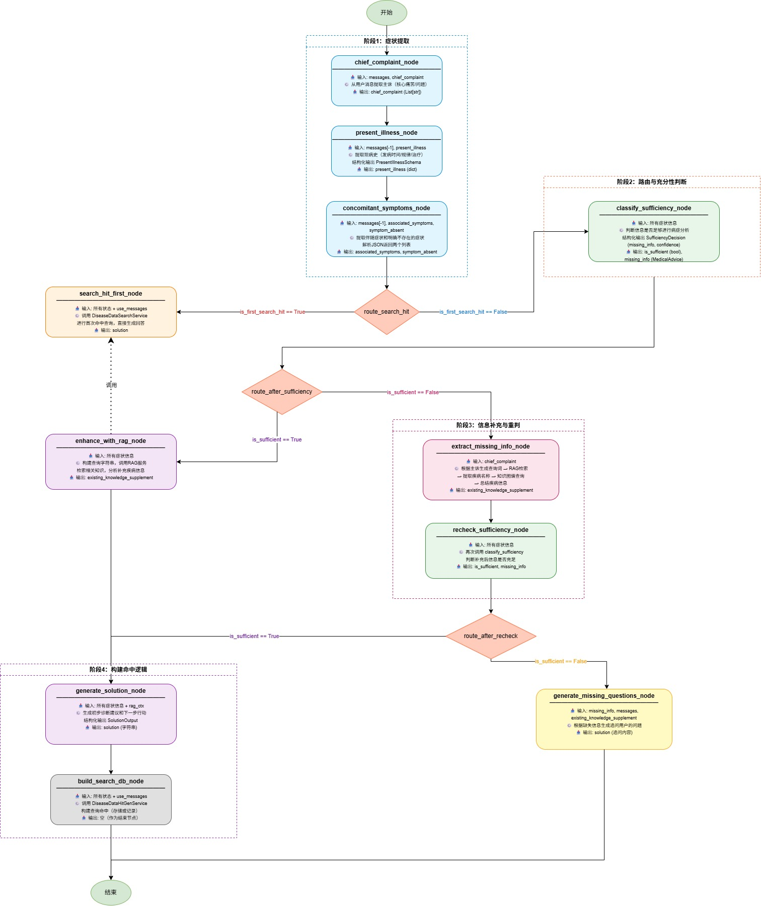

# 医疗信息探寻查询图结构功能点文档

## 1. 概述

本系统是一个基于 **LangGraph** 构建的医疗信息主动探寻助手，能够**逐步收集患者症状、现病史、伴随症状**等信息，通过**信息充分性判断**、**RAG知识增强**和**知识图谱查询**，智能判断是否需要追问缺失信息，并最终生成**初步诊断建议与下一步行动**。系统采用有向状态图（StateGraph）管理多轮对话流程，支持信息不充足时的**自动追问**与**信息充足时的方案生成**。

## 2. 核心功能模块

| 模块 | 功能描述 |
|------|----------|
| **主诉提取** | 从用户对话中提取核心痛苦/问题（如“头痛”、“咳嗽”等），存储为结构化主诉列表 |
| **现病史结构化** | 提取发病时间、发作规律（持续/阵发/间歇性）以及已接受的治疗/药物，输出为`PresentIllness`结构 |
| **伴随症状识别** | 从消息中提取用户存在的伴随症状（`associated_symptoms`）和明确不存在的症状（`symptom_absent`） |
| **信息充分性判断** | 基于已收集的所有症状信息，评估信息是否足够进行病症分析（置信度≥0.7为充足），同时生成初步医学建议（可能诊断、下一步行动、免责声明） |
| **RAG知识增强** | 使用当前症状信息查询医学知识库（`KnowledgeBaseService`），检索相关疾病知识片段，补充到`existing_knowledge_supplement`字段中 |
| **知识图谱查询** | 当信息不充足时，通过主诉触发RAG检索→提取疾病名称→查询Neo4j知识图谱，获取该疾病的详细结构化信息 |
| **缺失信息追问** | 根据信息充分性判断输出的`missing_info`（缺失项），生成针对性的追问问题，引导用户补充信息 |
| **解决方案生成** | 综合主诉、现病史、伴随症状及RAG上下文，生成结构化的初步诊断建议（可能诊断列表、推荐行动、免责声明） |
| **首次命中快速查询** | 在症状收集完成后，优先调用`DiseaseDataSearchService`进行快速命中查询，跳过完整信息判断流程（优化首次响应） |
| **数据持久化（构建查询命中）** | 将完整对话及分析结果提交给`DiseaseDataHitGenService`，用于后续数据挖掘或模型训练 |

## 3. 工作流节点详解

系统采用 **StateGraph** 编排任务，各节点功能如下（节点名称后缀 `_node` 已省略）：

### 3.1 `chief_complaint_node` – 主诉提取
- **输入**：历史消息列表（`state.messages`）  
- **输出**：`chief_complaint`（List[str]）  
- **实现**：调用 LLM 解析用户最新消息，提取核心症状/问题列表。

### 3.2 `present_illness_node` – 现病史结构化
- **输入**：历史消息 + 已有`present_illness`  
- **输出**：`present_illness`（包含`onset_time`, `pattern`, `treatments_received`）  
- **实现**：使用 LLM 的 `with_structured_output` 强制输出 `PresentIllnessSchema` 结构。

### 3.3 `concomitant_symptoms_node` – 伴随症状识别
- **输入**：历史消息 + 已有`associated_symptoms` / `symptom_absent`  
- **输出**：更新后的`associated_symptoms`和`symptom_absent`（均为列表）  
- **实现**：LLM 解析消息，输出 JSON 格式的两种症状列表。

### 3.4 `classify_sufficiency_node` – 信息充分性判断
- **输入**：`chief_complaint`, `present_illness`, `associated_symptoms`, `symptom_absent`, `existing_knowledge_supplement`, 消息文本  
- **输出**：  
  - `is_sufficient`（bool）：是否信息充足  
  - `missing_info`（`MedicalAdvice` 结构）：包含初步诊断、下一步行动、免责声明  
  - `confidence`（float）：置信度  
- **实现**：LLM 结构化输出 `SufficiencyDecision`，阈值 0.7。

### 3.5 `enhance_with_rag_node` – RAG 知识增强
- **输入**：上述症状字段  
- **输出**：`existing_knowledge_supplement`（包含 LLM 总结后的疾病分析 JSON）  
- **实现**：构建查询字符串 → 调用 `rag_service.query()` → LLM 整合检索结果生成疾病分析报告。

### 3.6 `generate_solution_node` – 生成解决方案
- **输入**：主诉、现病史、伴随症状、RAG 上下文  
- **输出**：`solution`（字符串，格式为“可能诊断：…\n建议行动：…\n免责声明：…”）  
- **实现**：LLM 结构化输出 `SolutionOutput`，然后格式化为文本。

### 3.7 `extract_missing_info_node` – 缺失信息提取（信息不足时）
- **输入**：主诉、消息历史  
- **输出**：`existing_knowledge_supplement`（疾病分析列表）  
- **实现**：  
  1. LLM 根据主诉生成检索查询词  
  2. RAG 检索 top‑3 知识片段  
  3. 对每个片段提取疾病名称  
  4. 查询知识图谱（`Neo4jQueryTools`）  
  5. LLM 综合图谱和 RAG 输出疾病分析 JSON  
  6. 汇总为列表存入状态。

### 3.8 `recheck_sufficiency_node` – 重新判断充分性
- **功能**：在信息补充（RAG 增强）后，再次调用 `classify_sufficiency` 逻辑，更新 `is_sufficient` 和 `missing_info`。  
- **实现**：直接复用 `classify_sufficiency` 方法。

### 3.9 `generate_missing_questions_node` – 追问生成
- **输入**：`missing_info`（缺失项）、消息历史、RAG 补充知识  
- **输出**：`solution`（追问文本）  
- **实现**：LLM 根据缺失信息生成自然语言提问，追加到 `messages` 中返回。

### 3.10 `search_hit_first_node` – 首次命中查询
- **输入**：完整的状态字段（主诉、现病史、症状等）  
- **输出**：`solution`（查询结果文本）  
- **实现**：调用 `DiseaseDataSearchService.run()`，快速返回预计算的可能疾病或建议。

### 3.11 `build_search_db_node` – 数据持久化节点
- **输入**：整个状态  
- **输出**：无（返回空字典）  
- **实现**：调用 `DiseaseDataHitGenService.run()`，将当前会话的所有信息发送给下游存储服务（用于构建查询命中数据库）。

## 4. 路由与流程

系统根据信息充分性、是否首次命中等因素，动态决定执行路径。



### 4.1 初始流程
```text
START → chief_complaint_node → present_illness_node → concomitant_symptoms_node
```

### 4.2 首次命中分支（路由函数 `route_search_hit`）
- 若 `is_first_search_hit == True`（初始状态） → `search_hit_first_node` → **END**
- 否则 → `classify_sufficiency_node`

### 4.3 信息充分性分支（路由函数 `route_after_sufficiency`）
- **信息充足**（`is_sufficient == True`） → `enhance_with_rag_node` → `generate_solution_node` → `build_search_db_node` → **END**
- **信息不足** → `extract_missing_info_node` → `recheck_sufficiency_node`

### 4.4 重新判断后的分支（路由函数 `route_after_recheck`）
再次判断 `is_sufficient`：
- **充足** → `generate_solution_node` → `build_search_db_node` → **END**
- **不足** → `generate_missing_questions_node` → **END**

### 4.5 流程图示意
```text
 START
   │
   ▼
chief_complaint
   │
   ▼
present_illness
   │
   ▼
concomitant_symptoms
   │
   ├─[is_first_search_hit?]─True─→ search_hit_first ─→ END
   │
   └─False
       │
       ▼
classify_sufficiency
       │
       ├─[sufficient?]─True─→ enhance_with_rag ─→ generate_solution ─→ build_search_db ─→ END
       │
       └─False
           │
           ▼
       extract_missing_info
           │
           ▼
       recheck_sufficiency
           │
           ├─[sufficient?]─True─→ generate_solution ─→ build_search_db ─→ END
           │
           └─False
               │
               ▼
           generate_missing_questions ─→ END
```

## 5. 持久化机制

本代码**未内置持久化**，但图结构天然支持 **LangGraph 检查点（Checkpointer）**。可通过 `graph.compile(checkpointer=...)` 集成 `SqliteSaver`、`RedisSaver` 等，实现会话状态自动保存与恢复。目前示例中为无持久化的一次性运行。

## 6. 外部依赖与集成

| 组件 | 用途 | 集成方式 |
|------|------|----------|
| `ChatOllama` (qwen3:8b) | 本地 LLM 推理引擎 | `get_base_chat_model()` 返回实例 |
| `KnowledgeBaseService` | RAG 检索（医学知识库） | `self.rag_service` 直接调用 |
| `Neo4jQueryTools` | 知识图谱查询（疾病结构化信息） | `self.knowledge_query_tools` |
| `DiseaseDataSearchService` | 首次命中快速检索 | `self.search_hit_client` |
| `DiseaseDataHitGenService` | 数据持久化/命中记录构建 | `self.analysis_db_client` |
| 提示词模板 | 各节点使用的 Prompt | 外部 `.txt` 文件，路径见 `PROMPT_PATHS` |
| `langgraph` | 状态图编排 | `StateGraph`, `add_messages` 归约器 |
| `pydantic` | 结构化输出验证 | `BaseModel`, `Field` |

## 7. 配置与扩展点

**提示词文件路径**（可自定义）：
```python
PROMPT_PATHS = {
    "sufficiency_decision_sys": "./prompt/discover/prompt_sufficiency_decision_sys.txt",
    "sufficiency_decision_user": "./prompt/discover/prompt_sufficiency_decision_user.txt",
    # ... 其他提示词路径
}
```

**RAG 检索参数**：`enhance_with_rag_node` 中 `rag_top_k=5`，`extract_missing_info_node` 中 `top_k=3`。
**充分性判断阈值**：`confidence >= 0.7` 视为信息充足。
**日志级别**：当前为 `logging.INFO`，可在 `basicConfig` 中调整。

## 8. 主要数据流（状态字段）

`MedicalInquiryState` 定义如下：

| 字段 | 类型 | 说明 |
|------|------|----------|
| `messages` | `Annotated[List[BaseMessage], add_messages]` | 对话消息历史（自动合并追加） |
| `chief_complaint` | `List[str]` | 主诉（患者最核心的痛苦/问题） |
| `present_illness` | `PresentIllness` (TypedDict) | 现病史：发病时间、规律、治疗/药物 |
| `associated_symptoms` | `List[str]` | 存在的伴随症状 |
| `symptom_absent` | `List[str]` | 明确不存在的症状 |
| `existing_knowledge_supplement` | `Dict[str, Any]` | RAG/图谱补充的医学知识（疾病分析等） |
| `missing_return_messages` | `str` | 临时候补字段（当前未使用） |
| `is_first_search_hit` | `bool` | 是否首次命中查询标志（初始为 `True`） |
| `is_sufficient` | `bool` | 当前信息是否充分（用于路由） |
| `missing_info` | `List[str]` | 缺失的信息项（在 `SufficiencyDecision` 中实际为 `MedicalAdvice` 结构） |
| `solution` | `str` | 最终生成的回答或追问文本 |
| `need_more_info` | `bool` | 是否需要更多信息（当前未使用） |
| `iteration_count` | `int` | 迭代计数（防止无限循环，当前未严格使用） |

## 9. 典型使用流程

1. **初始化**：创建 `MedicalDataDiscovery` 实例，内部初始化 LLM、RAG、知识图谱等工具。  
2. **准备初始状态**：提供用户消息（`HumanMessage`）及可选的初始 `discovery_data`（如已有部分症状）。  
3. **调用图执行**：`graph_client.get_medical_data_discovery(messages, discovery_data)`。  
4. **自动流转**：  
   - 依次提取主诉、现病史、伴随症状。  
   - 首次命中标志为 `True`，优先走 `search_hit_first_node` 快速返回（若需）。  
   - 若关闭首次命中，则进入充分性判断。  
   - 信息充足时：RAG 增强 → 生成解决方案 → 持久化 → 结束。  
   - 信息不足时：RAG 检索 + 知识图谱提取缺失信息 → 重新判断 → 若仍不足则生成追问问题；若充足则生成解决方案。  
5. **获取最终状态**：返回完整 `MedicalInquiryState`，其中 `solution` 字段包含给用户的回复，`messages` 字段包含完整对话历史。

## 10. 注意事项
- **生产环境建议**：  
  - 使用更稳定的 LLM API（如 OpenAI、Azure）替换本地 Ollama。  
  - 集成 LangGraph 检查点实现会话持久化。  
  - 为 RAG 检索添加缓存机制。【未完成】
  - 增加敏感信息过滤和医疗免责声明强化。